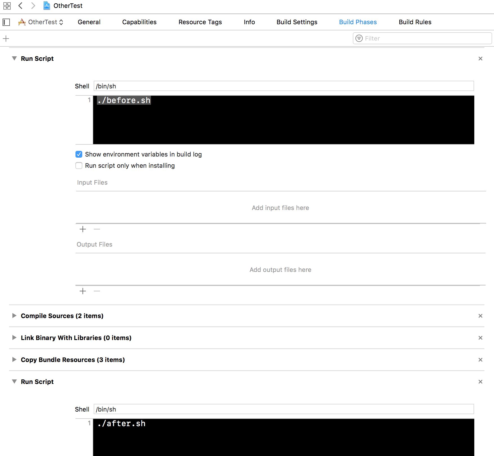

## XcodeBuildTimeMeasurement

Xcode Run scripts to measure how much time you spend on builds.

## Description

There are two sripts `before` and `after` as the names might suggest you need to run the first before xcode build and second after build is completed.
But no worries I will tell you how make the your environment to do it for you.

## How does it work

`before` is responsible for saving timestamp of the start run in a temporary file called `tmpLog`

`after` is where all the magic is. It will take timestamp from log file and basically copare it with current timestam to determine how much time xcode was building your project. It will also find your project name and with this name it will generate result csv file with summary time per day, it will look like this:

It will also delete temporary file that was generated by `before` script.

That is it, it's that simple. 

## How to install it

There are two different approches to connect these files with Xcode

# The General Xcode configuration

- Copy files to whatever directory you would like to have then, in this approach they will be run by xcode so they can by loaded from wherever you like.
- Open Xcode Settings `cmd+,` and go to `Behaviors`
- In Build Section you will find rows like:

# Start

# Success

# Fails

- Now the only thing you need to do is to check `Run` in all of the configurations and select correct scripts for all of them
- `before` for start and `after` for Fails and Success

- (if you can't choose script) Sometimes files can have wrong access mode so just run `chmod +ux` on them and it should fix this issue

- (optional) if for some reason you don't want to measure faild build times then just don't do anything with Fails configuration.

That is is, now you can run the script and your build times will be counted in result file in your project directory.

With this configuration acctually every build for every project will be measured, casue this is global configuration for Xcode, but it allows you to measure Faild build time.

# Run Script Configuration

This configuration will use posibility to add `Run Script` to `Build Phases` in Xcode, but this one is per project.

1. All you need to do is go to `Build Phases` of your project and by selecting `+` select `New Run script Phase`.
2. You want to add two of these, remember `before` and `after`
3. Now just move one of them on top of the list and the other on the bottom.
4. In the one on top int the sctipt body just write something like this:

`./before.sh`

- Remember about the path, it will change accordingly to where are the scripts.
- The same thing for the bottom run script:

`./after.sh`

It all yout look something like this:

- Done, Now scripts will generate time measurement file.

Disadvantage for this approach is that it will not measure time when build will fail (unless you will set flag PBXBuildsContinueAfterErrors to YES). 

## Created by
Paweł Kowalczuk,
[@riamf1](https://twitter.com/riamf1)

